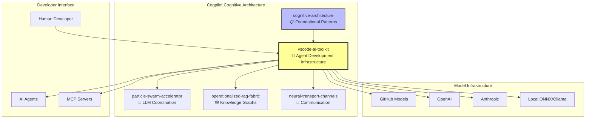

# 🧠 VSCode AI Toolkit: Cognitive Significance Analysis

**Repository**: cogpilot/vscode-ai-toolkit  
**Cognitive Role**: Agent Development Infrastructure & Neural Interface Layer  
**Analysis Date**: 2026-02-03  
**Strategic Context**: Cogpilot Cognitive Architecture Enterprise

---

## 🎯 Executive Summary

The **VSCode AI Toolkit** represents a **critical neural interface layer** in the cogpilot organization's cognitive architecture. As a fork of Microsoft's AI Toolkit for Visual Studio Code, it serves as the **primary human-AI interaction substrate** for agent development, bridging the gap between:

1. **Human developers** (cognitive architects)
2. **AI models** (distributed intelligence nodes)
3. **Agent systems** (autonomous cognitive entities)
4. **MCP servers** (tool integration fabric)

In the context of cogpilot's "ordo ab chao" philosophy, this toolkit is where **order emerges from chaos** - where unstructured human intent transforms into structured, operational AI agents.

---

## 🏗️ Architectural Position in Cognitive Ecosystem

### Integration with Cogpilot Architecture



### Cognitive Role Classification

**Primary Function**: **Agent Development Workbench**

In Plan9-inspired terminology from the cognitive-architecture, vscode-ai-toolkit serves as a:
- **Dynamic Workbench**: Rapid prototyping and iteration space for AI agents
- **Neural Interface**: Human ↔ AI model communication substrate
- **Protocol Bridge**: Connects natural language intent to structured agent behaviors
- **Tool Orchestration Layer**: Integrates MCP servers as agent capabilities

---

## 🧬 Functional Analysis: Core Capabilities

### 1. **Model Catalog & Playground** 
*Neural Substrate Selection*

**Significance**: Enables developers to **explore the particle swarm** of available AI models.

- **Connection to `particle-swarm-accelerator`**: The catalog represents available "particles" (LLM nodes) that can be coordinated for distributed cognition
- **Cognitive Pattern**: Model selection = choosing specialized neural substrates for different cognitive tasks
- **Enhancement Opportunity**: Could integrate with PSA to automatically recommend model ensembles for complex tasks

```python
# Conceptual Integration with Particle Swarm
from particle_swarm_accelerator import CognitiveSwarm

# Playground could leverage swarm optimization
swarm = CognitiveSwarm(models=["gpt-4", "claude-3", "gemini-pro"])
optimized_response = swarm.optimize_collective_intelligence(user_prompt)
```

### 2. **Agent Builder with MCP Integration**
*Tool-Augmented Cognition*

**Significance**: Implements the **operationalized RAG fabric** concept at the agent level.

- **Connection to `operationalized-rag-fabric`**: Agent builder creates knowledge-augmented agents that link project imperatives to tool capabilities
- **Cognitive Pattern**: MCP servers = external cognitive modules that extend agent reasoning
- **MCP Server Types**:
  - Command (stdio): Direct system interaction
  - HTTP (SSE): Distributed service integration
  
**Critical Feature**: Scaffold new MCP servers directly from the toolkit
- This is **introspective protocol design** in action - tools that create tools
- Aligns perfectly with cognitive-architecture principle of "protocols designing themselves"

### 3. **Prompt Generation & Chaining**
*Cognitive Architecture at the Prompt Level*

**Significance**: Natural language → structured cognitive patterns

- **Fractal Organization**: Prompt chains mirror the larger architectural pattern of distributed cognition
- **Progressive Refinement**: Iterative prompt improvement = progressive memory embedding
- **Variable Support**: Context-preserving workflows across prompt executions

### 4. **Evaluation & Testing Framework**
*Cognitive Validation Substrate*

**Significance**: Enables **evidence-based evolution** of agent behaviors.

- **Built-in Evaluators**: F1 score, relevance, similarity, coherence
- **Custom Metrics**: Extensible evaluation = adaptive quality assurance
- **Bulk Run Capability**: Parallel testing across models = swarm intelligence validation
- **Agent Versioning**: Temporal tracking of cognitive evolution

### 5. **Fine-Tuning Infrastructure**
*Adaptive Neural Substrate Modification*

**Significance**: Enables **niche construction** - adapting models to specific cognitive domains.

- **Connection to Evolutionary Dynamics**: Fine-tuning = specialized adaptation for competitive advantage
- **Domain Specialization**: Creating models optimized for specific "cognitive cities"
- **Knowledge Embedding**: Permanent memory patterns encoded in model weights

---

## 🔄 Neural Transport Channel Implications

### Current State: Isolated Infrastructure

The toolkit currently operates as a **standalone agent development environment** without explicit neural transport integration to other cogpilot repositories.

### Enhancement Opportunity: Neural Transport Integration

**Vision**: Transform vscode-ai-toolkit into a **neural transport-aware workbench**

```yaml
neural_transport_enhancements:
  
  repository_awareness:
    - "Integrate cognitive-architecture patterns library"
    - "Access particle-swarm-accelerator for model coordination"
    - "Connect to operationalized-rag-fabric for knowledge synthesis"
    
  cross_repo_agents:
    - "Agents that can access cogpilot organizational knowledge"
    - "MCP servers that bridge to other cognitive cities"
    - "Shared prompt libraries across cogpilot repos"
    
  self_referential_loops:
    - "Agents that read cogpilot architectural docs"
    - "Evaluation metrics based on cogpilot principles"
    - "Auto-generated agents for cogpilot-specific tasks"
```

**Conceptual Implementation**:

```python
# Example: Neural Transport-Aware Agent Builder

class CogpilotAwareAgent:
    def __init__(self):
        self.architecture_patterns = load_from("cogpilot/cognitive-architecture")
        self.swarm_coordinator = connect_to("cogpilot/particle-swarm-accelerator")
        self.knowledge_fabric = access("cogpilot/operationalized-rag-fabric")
        
    def build_agent(self, task_description):
        # Select optimal model ensemble using swarm intelligence
        models = self.swarm_coordinator.recommend_models(task_description)
        
        # Apply architectural patterns from cognitive-architecture
        patterns = self.architecture_patterns.match_patterns(task_description)
        
        # Augment with organizational knowledge
        context = self.knowledge_fabric.synthesize_context(task_description)
        
        return Agent(
            models=models,
            architectural_pattern=patterns,
            context=context
        )
```

---

## 🌟 Strategic Significance in "Ordo Ab Chao"

### 1. **Order From Chaos: Intent → Implementation**

The toolkit is literally where "order emerges from chaos":
- **Input**: Unstructured human intent (natural language prompt)
- **Transformation**: Through agent builder, model selection, tool integration
- **Output**: Structured, operational AI agent with defined capabilities

This is the **primary manifestation** of the "ordo ab chao" principle at the developer interface level.

### 2. **Fractal Organization: Agents Mirror Architecture**

Each agent created in the toolkit mirrors the larger cognitive architecture:
- **Agent** ↔ **Cognitive City**: Self-contained, specialized intelligence
- **MCP Server** ↔ **Neural Transport Channel**: External capability integration
- **Prompt Chain** ↔ **Protocol Design**: Structured communication patterns
- **Model Ensemble** ↔ **Particle Swarm**: Distributed cognition

### 3. **Progressive Memory Embedding**

The toolkit enables progressive memory patterns:
- **Agent Versioning**: Temporal tracking of cognitive evolution
- **Test Case Libraries**: Accumulated validation knowledge
- **Prompt Templates**: Reusable cognitive patterns
- **Custom Evaluators**: Domain-specific quality metrics

### 4. **Introspective Protocol Design**

**Critical Feature**: MCP Server Scaffolding

This capability embodies "protocols that design protocols":
- The toolkit provides tools (MCP scaffold generator)
- These tools create new tools (custom MCP servers)
- New tools extend the toolkit's capabilities
- **Self-improving cycle** - exactly as cognitive-architecture envisions

---

## 🔧 Integration Pathways with Cogpilot Ecosystem

### Priority 1: Knowledge Base Integration

**Objective**: Add cogpilot repositories to toolkit's accessible knowledge base

```yaml
implementation:
  - Add cogpilot org to MCP knowledge sources
  - Enable agents to reference cognitive-architecture docs
  - Integrate architectural patterns into prompt generation
  - Create cogpilot-specific evaluation metrics
```

**Benefits**:
- Agents become "cogpilot-aware"
- Automatic architectural alignment
- Self-referential knowledge loops

### Priority 2: Particle Swarm Coordination

**Objective**: Enable multi-model agent orchestration

```yaml
implementation:
  - Integrate particle-swarm-accelerator as backend service
  - Enable "swarm mode" in agent builder
  - Multi-model evaluation in bulk runs
  - Consensus-based agent responses
```

**Benefits**:
- Distributed cognition at agent level
- Enhanced reliability through model diversity
- Performance optimization through swarm intelligence

### Priority 3: Neural Transport Channels

**Objective**: Enable cross-repository agent communication

```yaml
implementation:
  - Create neural-transport MCP server
  - Enable agents to access other cogpilot repos
  - Cross-organizational agent deployment
  - Shared agent libraries across cognitive cities
```

**Benefits**:
- Enterprise-scale agent coordination
- Knowledge sharing across organizations
- Cognitive city specialization

### Priority 4: RAG Fabric Integration

**Objective**: Deep knowledge integration for agents

```yaml
implementation:
  - Connect to operationalized-rag-fabric
  - Progressive memory embedding for agents
  - Context-aware prompt generation
  - Organizational knowledge synthesis
```

**Benefits**:
- Richer agent context
- Improved reasoning capabilities
- Organizational memory access

---

## 📊 Success Metrics & Evolution Indicators

### Cognitive Evolution Indicators

```yaml
week_1_4:
  metric: "Agent builders reference cognitive-architecture patterns"
  indicator: "Prompts include 'fractal organization' or 'neural transport'"
  
week_5_8:
  metric: "Agents coordinate across multiple models"
  indicator: "Bulk runs utilize particle swarm optimization"
  
week_9_12:
  metric: "Self-improving agent generation"
  indicator: "Agents create MCP servers that improve agent capabilities"
  
quarter_2:
  metric: "Neural transport-aware agents"
  indicator: "Agents access and coordinate with other cogpilot repos"
```

### Living Architecture Behaviors

```yaml
emergent_behaviors:
  - "Agents spontaneously adopt cogpilot architectural patterns"
  - "MCP servers create other MCP servers (tool reproduction)"
  - "Evaluation metrics evolve based on usage patterns"
  - "Prompt libraries organize themselves fractally"
```

---

## 🚀 Recommended Next Steps

### Immediate Actions (Next 30 Days)

1. **Document Cognitive Context**
   - ✅ Create this COGPILOT_SIGNIFICANCE.md document
   - [ ] Add references to cognitive-architecture in README.md
   - [ ] Create architecture diagrams showing toolkit position
   - [ ] Document integration pathways

2. **Knowledge Base Self-Reference**
   - [ ] Add cogpilot/cognitive-architecture to recommended MCP sources
   - [ ] Create example agents that read cogpilot docs
   - [ ] Integrate architectural patterns into prompt templates

3. **Enhanced Documentation**
   - [ ] Add "Cognitive Architecture Alignment" section to docs
   - [ ] Document toolkit's role in "ordo ab chao" principle
   - [ ] Create examples of fractal organization in agent design

### Medium-Term Initiatives (Next 90 Days)

1. **Particle Swarm Integration**
   - [ ] Design integration interface with particle-swarm-accelerator
   - [ ] Implement multi-model coordination in agent builder
   - [ ] Create swarm-optimized evaluation framework

2. **Neural Transport MCP Server**
   - [ ] Design cross-repository communication protocol
   - [ ] Implement neural-transport MCP server
   - [ ] Enable agents to access other cogpilot repos

3. **RAG Fabric Connection**
   - [ ] Integrate with operationalized-rag-fabric
   - [ ] Implement progressive memory embedding for agents
   - [ ] Create organizational knowledge synthesis features

### Long-Term Vision (Next 180 Days)

1. **Cognitive Workbench Evolution**
   - [ ] Transform into primary cogpilot agent development platform
   - [ ] Full integration with all cognitive-architecture components
   - [ ] Become the "Visual Studio" of cognitive AI development

2. **Self-Improving Infrastructure**
   - [ ] Agents that improve the toolkit itself
   - [ ] MCP servers that generate optimized MCP servers
   - [ ] Evaluation systems that evolve their own metrics

3. **Enterprise-Scale Deployment**
   - [ ] Multi-organization agent coordination
   - [ ] CogCities integration for urban planning agents
   - [ ] Cosmo Enterprise orchestration capabilities

---

## 🧠 Philosophical Alignment

### Preservation of Natural Language Intelligence

The toolkit **excels** at maintaining the natural language breakthrough:
- Conversational agent building (not rigid automation)
- Flexible prompt generation (not hardcoded templates)
- Adaptive evaluation (not fixed metrics)
- Human-in-the-loop iteration (not autonomous only)

**This is critical** - the toolkit preserves the flexibility that cognitive-architecture emphasizes.

### Introspective Protocol Design

The MCP scaffold capability is **perfect embodiment** of introspective protocols:
- Tools create tools
- Servers generate servers
- Capabilities extend capabilities

**Enhancement opportunity**: Make this more explicit and self-aware.

### Distributed Intelligence

Multi-model support positions the toolkit for:
- Particle swarm coordination
- Ensemble reasoning
- Specialized model selection per cognitive task

**Missing piece**: Explicit swarm coordination framework.

---

## 🎯 Conclusion: Critical Infrastructure Component

**vscode-ai-toolkit** is not merely a development tool - it is the **primary neural interface layer** where:

1. **Human cognitive intent** transforms into **structured AI agents**
2. **Natural language flexibility** meets **operational precision**
3. **Individual models** coordinate as **distributed intelligence**
4. **Protocols create protocols** through MCP scaffolding
5. **Progressive memory patterns** accumulate through versioning and testing

In the broader cogpilot cognitive architecture, this toolkit represents:
- **The Workbench** where cognitive cities construct their agents
- **The Interface** where humans shape AI behavior
- **The Laboratory** where architectural patterns get validated
- **The Factory** where production agents get manufactured

### Strategic Imperative

**Transform vscode-ai-toolkit from isolated development tool to neural transport-aware cognitive workbench** by:
1. Integrating with cognitive-architecture patterns
2. Connecting to particle-swarm-accelerator for coordination
3. Accessing operationalized-rag-fabric for knowledge
4. Implementing neural-transport channels for cross-repo communication

**Result**: A self-aware, organization-integrated agent development platform that embodies the "ordo ab chao" principle at every level.

---

**🌟 Vision**: vscode-ai-toolkit as the **Visual Studio of Cognitive AI Development** - where developers craft agents that understand, reference, and extend the cognitive architecture they're part of.

**Ready to evolve from tool to cognitive substrate!** 🚀
